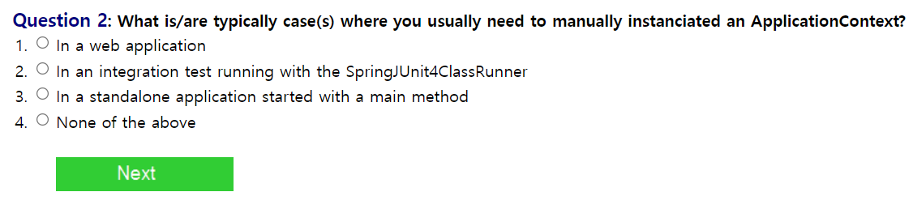
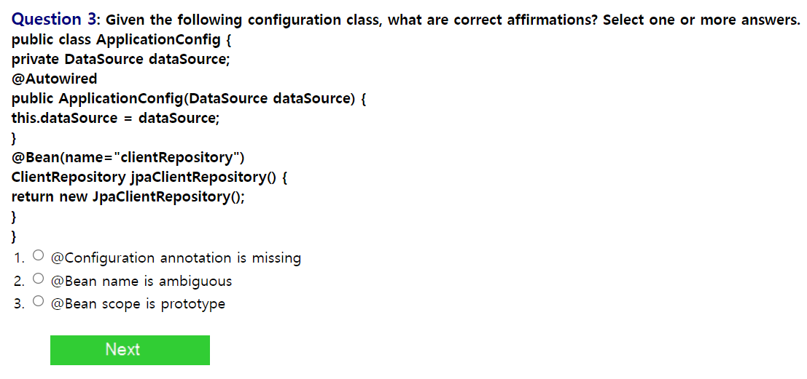

1. XML<context:namespace 의 특징은 무엇인가?

A. 이 태그는 Autowired 어노테이션을 이용할 수 있게 해준다.

2. ApplicationContext를 직접 설정해야 하는 경우는 무엇인가?

A. ApplicationContext는 Spring에서 생성되는 Bean을 관리하는 컨테이너의 역할을 하는데
웹 어플리케이션의 경우에는 기본적으로 서버가 실행될 때 BeanFactory를 상속받아서 생성된다.
사용자가 따로 main 메서드에서 생성할 필요가 있을 때는 수동으로 생성할 수 있을 것이라고 생각했다.

3. 해당 클래스에 대한 올바른 설명을 구하시오.

