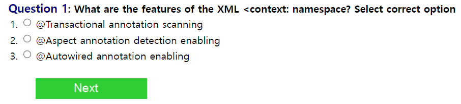
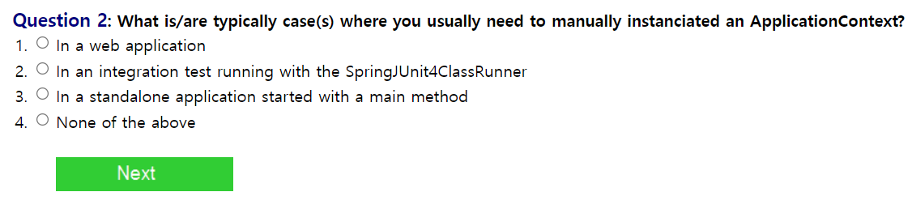
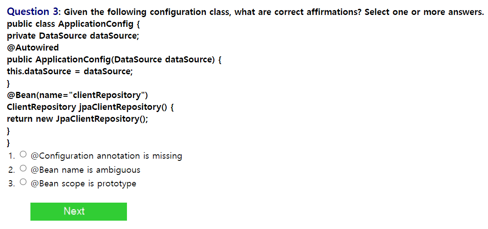
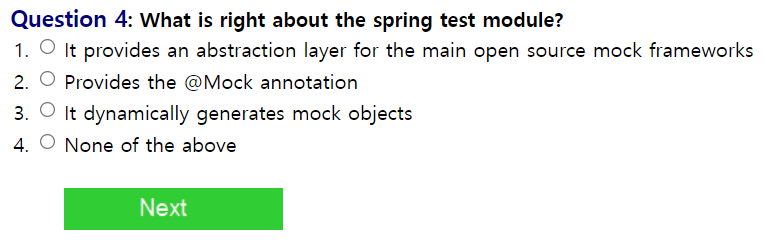
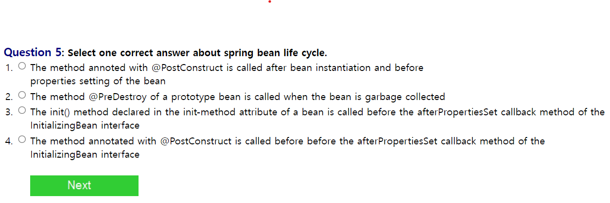
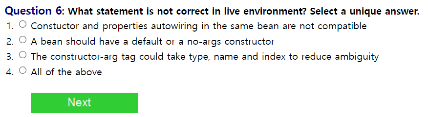
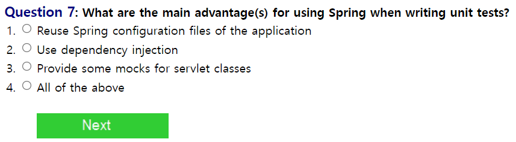
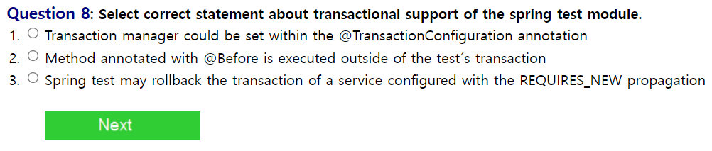
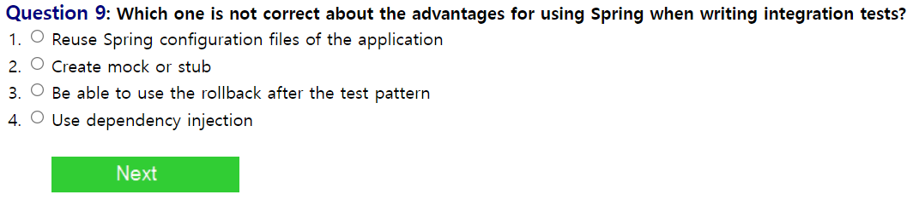
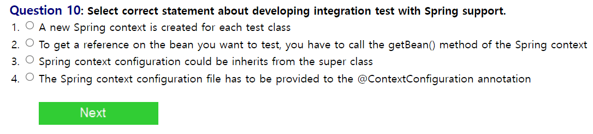

  

## Q1. XML 태그 context:namespace 의 특징은 무엇인가?  

## A1. 
이 태그는 Autowired 어노테이션을 이용할 수 있게 해준다.  

 

 
## ApplicationContext를 직접 설정해야 하는 경우는 무엇인가?

 
## A. 
ApplicationContext는 Spring에서 생성되는 Bean을 관리하는 컨테이너의 역할을 하는데
웹 어플리케이션의 경우에는 기본적으로 서버가 실행될 때 BeanFactory를 상속받아서 생성된다.
사용자가 따로 main 메서드에서 생성할 필요가 있을 때는 수동으로 생성할 수 있을 것이라고 생각했다.

 

 
## 해당 클래스에 대한 올바른 설명을 고르시오.
 
## A. Configuration 클래스이기 때문에 해당 어노테이션이 필요하다.

 

 
## 스프링 테스트 모듈에 대한 올바른 설명을 고르시오.
 
## A. 배우지 않은 내용이라서 일단 스킵했습니다.

 

 
## 스프링 빈 사이클에 대한 올바른 설명을 고르시오.
 
## A. 내용이 좀 배우지 않은 내용인데 찾아보고 쓰려면 시간이 걸릴것같습니다..
 
##  

 

 

 

 

 

