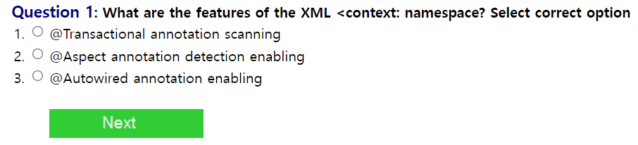

  

## Q1. 
    XML 태그 context:namespace 의 특징은 무엇인가?

## A1. 
    해당 위치 아래에 있는 @Component, @Service, @Controller, @Repository 어노테이션을
    검색해서 등록한 후 해당 객체의 의존성을 관리해준다. 추후 @Autowired 어노테이션을 통해
    의존성이 주입된 객체를 이용할 수 있다.
    답: 3

  
  

## Q2.
    ApplicationContext를 직접 인스턴스화하여 사용해야 하는 경우는 무엇인가?

## A2.
    ApplicationContext는 BeanFactory 인터페이스의 하위 인터페이스이며 스프링 컨테이너 역할을 한다.
    문제와 같은 경우는 여러 상황이 있을 수 있지만 주로 Spring Bean이 아닌 객체에서 스프링 컨테이너가 관리하는 객체에
    접근할 필요가 있을 때(또는 더 흔하게는 자바를 통해서 설정파일을 등록할 때)이를 인스턴스화할 필요가 있을 것이다. 그래서 3번이 제일 답에 가깝다.
    답: 3
    

  
  

## Q3.
    해당 클래스에 대한 올바른 설명을 고르시오.
## A3.
    Configuration 클래스이기 때문에 해당 어노테이션이 필요하다.
    답: 1

  
   

## Q4.
    스프링 테스트 모듈에 대한 올바른 설명을 고르시오.
## A4.
    해당 설명들은 모두 mockito에 대한 설명에 해당한다.
    답: 4

  
  

## Q5.
    스프링 빈 라이프 사이클에 대한 올바른 설명을 고르시오.

## A5. 
    스프링 빈 라이프 사이클을 아래 사진을 참고해 간략히 정리해보면 다음과 같다.
    1. 컨테이너 안에서 생성자를 이용하여 생성되고 setter method를 이용해 DI가 일어난다.
    2. 생성에 필요한 여러 작업들이 일어난다.
    3. @PostConstructed 메서드는 이 시점에서 실행된다.
    4. 각 bean의 init method가 실행된 후 작동한다.
    5. 종료될때가 되면 먼저 @PreDestroy 어노테이션이 붙은 메서드가 실행된다.
    6. detroy 메서드와 함께 종료되며 이후 finalize 메서드로 내부적으로 리소스가 반환된다.
    7. 추후 가비지 컬렉션이 일어난다

    이제 문제의 각 보기들을 정리해보면 다음과 같다.
    1. @PostConstructed 메서드는 객체화 후, property 세팅 전에 일어난다.
        -> 이는 위 내용의 2번에 해당되는 내용인데 @PostConstructed는 그 이후이므로 정답이 아니다.
    2. @Predestroyed는 가비지 컬렉션이 일어날 때 일어난다.
        -> 우선 순서상으로도 가비지 컬렉션이 가장 마지막이고 prototype bean의 경우에는 detory가 실행되지 않는다.
    3. InitializingBean interface의 AfterPropertiesSet 콜백 메서드 실행 이전에 init method가 실행된다.
        -> 설명에는 생략되었는데 init method 실행 이후 InitializingBean.afterPropertiesSet()이 일어난다.
    4. @PostConstructed 메서드는 InitializingBean.afterPropertiesSet() 이전에 일어난다.
        -> 위 순서에 따라서 정답이 맞다.

    답: 4

    

  
  

## Q6.
    live environment에 대한 설명 중 맞는 것을 고르시오
    
## A6.
    1. 같은 Bean에서 생성자를 이용한 방식과 setter를 이용한 방법의 autowiring은 공존할 수 없다.
    2. bean은 default나 인자가 없는 생성자가 있어야 한다.
    3. contructor-arg 태그는 type, name, index(index는 인자의 순서)를 설정할 수 있다.
    3개 모두 맞는 내용이다.

    답: 4
    
    
  
  

## Q7.
    단위 테스트 작성할 때 스프링을 사용하는 이점은?
    
## A7.
    1. 어플리케이션의 Spring Configuration 파일을 재사용한다.
    2. 의존성을 주입할 때 사용한다.
    3. 서블릿클래스의 mock을 제공한다.
    1,2번은 단위 테스트 작성 시 Spring container는 사용하지 않는다.
    3번은 org.springframework.mock 패키지가 MockHttpSession이나 MockHttpContext 같은 mock 클래스를 제공한다.

    답: 3
  
  

## Q8.
    Spring Test Module이 트랜잭션을 지원하는 내용 중 옳은 것을 고르시오.
## A8.
    1. 트랜잭션 매니저는 @TransactionConfiguration 어노테이션 내에서 설정할 수 있다.
    2. @Before 어노테이션이 달린 메소드는 트랜잭션 밖에서 실행된다.
    3. Spring Test는 REQUIRES_NEW 전파레벨로 구성된 서비스의 트랜잭션을 롤백할 수 있다.
    
    답: 1
  
  

## Q9.
    통합 테스트시 Spring을 사용하는 이점으로 옳지 않은 것은?
## A9.
    1. 어플리케이션의 스프링 구성 파일 재사용
    2. mock 또는 stub 만들기
    3. test pattern 후 롤백을 사용할 수 있다.
    4. 의존성 주입을 사용한다.
    mock 또는 stub을 만드는 것은 단위테스트에 더 적합하다.

    답: 2
  
  

## Q10.
    스프링 지원으로 통합 테스트 개발시 옳은 것을 고르시오.
## A10.
    1. 각 테스트케이스에 대해 새로운 spring context가 생성된다.
    2. 테스트 하려는 bean에 대한 참조를 하려면 getBean()메소드를 호출해야한다.
    3. spring context 구성은 슈퍼클래스에 상속될 수 있다.
    4. spring context 구성파일은 @ContextConfiguration 어노테이션에 제공되야한다.
    기본적으로 @ContextConfiguration 어노테이션이 있는 클래스는 어노테이션이 있는 
    수퍼클래스에 의해 정의된 spring context 구성 파일의 위치를 상속합니다. 
    이 속성의 상속된 위치 통해 이 기본 동작을 변경할 수 있습니다.

    답: 3

